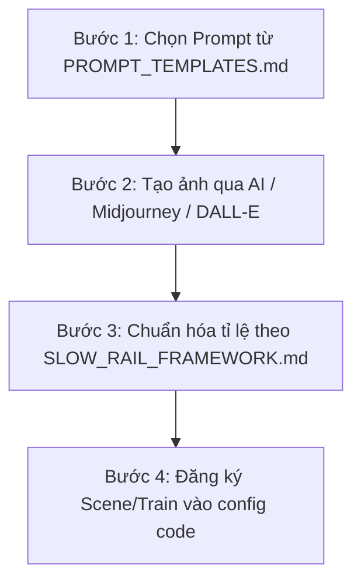

# 📁 Thư Viện Framework Chuẩn Hóa & Prompt Mẫu (Pixel Art Asset System)
> **Tài liệu hướng dẫn toàn diện dành cho việc thiết kế, tạo sinh (AI Generation) và tích hợp các chủ đề phong cảnh, đoàn tàu mới cho dự án "Chuyến Tàu Không Vội (Train to the Neverland)".**

---

## 🗂️ Danh mục tài liệu trong thư mục này

1. 📘 [SLOW_RAIL_FRAMEWORK.md](./SLOW_RAIL_FRAMEWORK.md)  
   *Đặc tả kỹ thuật kiến trúc đồ họa, hệ trục tọa độ 8 lớp Z-index, kích thước logic `960x440`, quy chuẩn lát cắt background `3.34:1`, tỉ lệ vàng con tàu `52.8%`, cơ chế lật gương lặp vô tận `scaleX(-1)`, và các công thức ánh sáng 4 thời điểm trong ngày.*

2. 🪄 [PROMPT_TEMPLATES.md](./PROMPT_TEMPLATES.md)  
   *Thư viện Prompt mẫu chuyên biệt (Midjourney v6, DALL-E 3, Stable Diffusion, Canvas Design) được tối ưu hóa cho từng thể loại: Thành phố hiện đại, Cố đô cổ kính, Kỳ quan núi non Việt Nam, Vịnh biển đảo, Vũ trụ & Cyberpunk, và các dòng đoàn tàu 3 toa.*

3. 📏 [QUICK_REFERENCE.md](./QUICK_REFERENCE.md)  
   *Bảng tra cứu nhanh các chỉ số kỹ thuật (Cheat sheet 1 trang) về pixel size, aspect ratio, vận tốc cuộn Parallax, mã màu ánh sáng và kích thước bounding box.*

4. ⚙️ [PIXEL_ART_ASSET_STANDARD.md](./PIXEL_ART_ASSET_STANDARD.md)  
   *Quy chuẩn kỹ thuật file ảnh: định dạng PNG trong suốt, tối ưu hóa màu sắc 16-bit, tạo mask đèn đêm (emissive lights mask), và thuật toán xử lý ảnh bằng Sharp/NodeJS.*

---

## 🚀 Quy trình 4 bước tạo Theme mới từ Prompt đến Web App

### Bước 1: Sao chép Prompt mẫu
* Mở [PROMPT_TEMPLATES.md](./PROMPT_TEMPLATES.md), chọn thể loại địa danh hoặc dòng tàu bạn muốn thêm.
* Thay thế tên địa điểm và chi tiết mong muốn vào các placeholder `[ĐỊA DANH]`.

### Bước 2: Tạo sinh ảnh
* Sử dụng Midjourney (`--ar 3:1` cho phong cảnh, `--ar 9:1` cho tàu), DALL-E 3 hoặc Canvas Design.
* Đảm bảo ảnh xuất ra có góc nhìn thẳng ngang (Flat side-scrolling perspective), đường chân trời nằm ở 75% phía dưới.

### Bước 3: Cắt lát & Kiểm tra kỹ thuật
* Đặt ảnh vào thư mục `public/assets/landscapes/[id_mới]/background.png`.
* Resize hoặc scale về chuẩn `1920 x 600 px` (hoặc `725 x 217 px`).
* Sử dụng cơ chế lật gương `scaleX(-1)` trên Panel 2 để nền tự động nối vô tận không tì vết.

### Bước 4: Tự động nhận diện (Zero Code)
* Bạn **KHÔNG CẦN sửa bất kỳ dòng code nào**!
* Hệ thống Vite Plugin & Asset Scanner sẽ tự động phát hiện thư mục mới và nạp ga tàu/đoàn tàu mới vào menu dropdown trên website ngay lập tức.
* (Tùy chọn) Thêm file `meta.json` vào thư mục để tùy chỉnh tên tiếng Việt, lời giới thiệu và bảng màu bầu trời.

